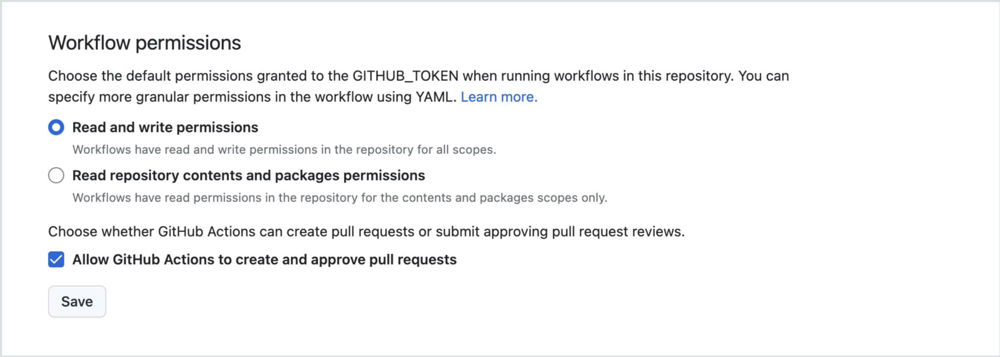
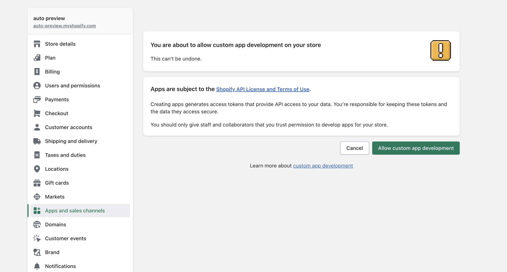
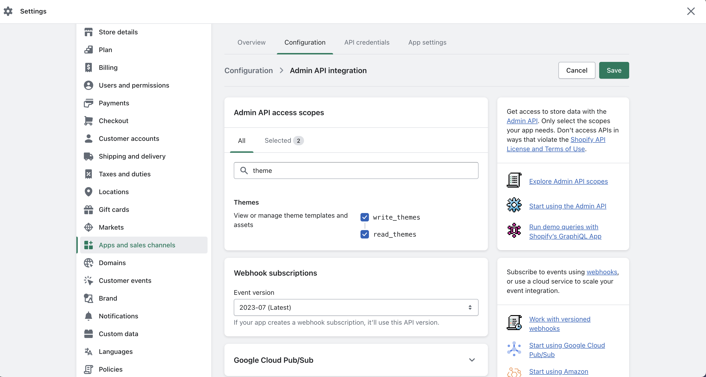
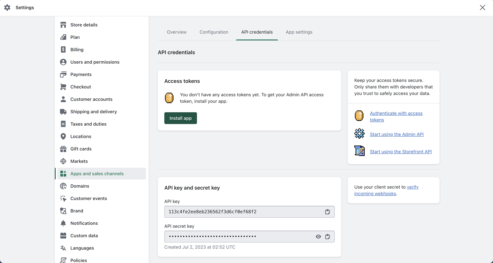
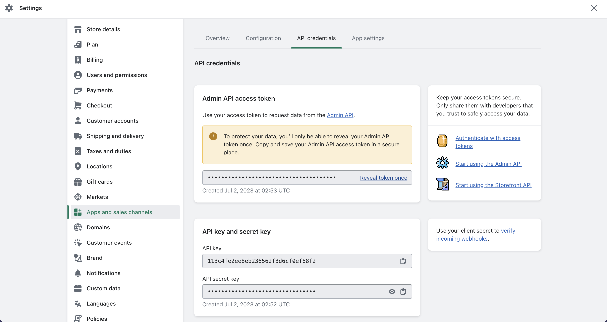

# shopify-theme-preview

Creates/Updates a Shopify theme to the respective tore and adds the preview link within the PR description and also as a comment.

The workflow is triggered when a Pull Request is both opened and any additional commits are made to the branch.

## Repository Settings



> Append `/settings/actions` to the base repo URL to access the above settings. The setting `Read and write permissions` is required while the checkbox is optional.

## Variables Setup

| Secret                  | Description                                          | Required |  Type   |
| ----------------------- | ---------------------------------------------------- | :------: | :-----: |
| SHOPIFY_FLAG_STORE      | The Shopify store URL e.g. store-name.myshopify.com  |   true   | String  |
| SHOPIFY_CLI_THEME_TOKEN | The Shopify CLI theme token created via a custom app |   true   | Number  |
| BUILD_PRODUCTION        | Assumes there is a script named: "build:production"  | optional | Boolean |

### SHOPIFY_FLAG_STORE

The store URL e.g. `store-name.myshopify.com`

### SHOPIFY_CLI_THEME_TOKEN

The following is a walkthrough to obtain the `SHOPIFY_CLI_THEME_TOKEN`:



> Append `/admin/settings/apps/development` to the shopify store URL to allow custom app development



> Select `write_themes` and `read_themes` within the Admiin API access scopes



> Install the custom app



> Click `Reveal token once` and use the value for `SHOPIFY_CLI_THEME_TOKEN`

### Secrets

Both `SHOPIFY_FLAG_STORE` and `SHOPIFY_CLI_THEME_TOKEN` should live as secrets and can be achieved by appending `/settings/secrets/actions` to the repo URL and selecting `New repository secret`.

### BUILD_PRODUCTION

Usually, when you are building a shopify theme locally, you will have made local edits via a pull request and then wish to compile an javascript
or any other build logic prior to theme deployment. There is an optional flag named `BUILD_PRODUCTION` which if set to `true` will look for a script command within the `package.json` file and execute just before a shopify theme is created/updated.

```js
// package.json
"scripts": {
  "build:production": ""
},
```

> Enter any build related compilation as the value.

## Usage

```yml
steps:
  - uses: Jay-Plumb/shopify-theme-preview@main
    with:
      shopify-flag-store: ${{ env.SHOPIFY_FLAG_STORE }}
      shopify-cli-theme-token: ${{ env.SHOPIFY_CLI_THEME_TOKEN }}
      build-production: ${{ env.BUILD_PRODUCTION }}
```

| flag             | required |  type   |
| ---------------- | :------: | :-----: |
| node-version     |  false   | Integer |
| build-production |  false   | Boolean |
| path             |  false   | String  |

```yml
steps:
  - uses: Jay-Plumb/shopify-theme-preview@main
    with:
      shopify-flag-store: ${{ env.SHOPIFY_FLAG_STORE }}
      shopify-cli-theme-token: ${{ env.SHOPIFY_CLI_THEME_TOKEN }}
      build-production: ${{ env.BUILD_PRODUCTION }}
      node-version: 16
      path: shop
```
